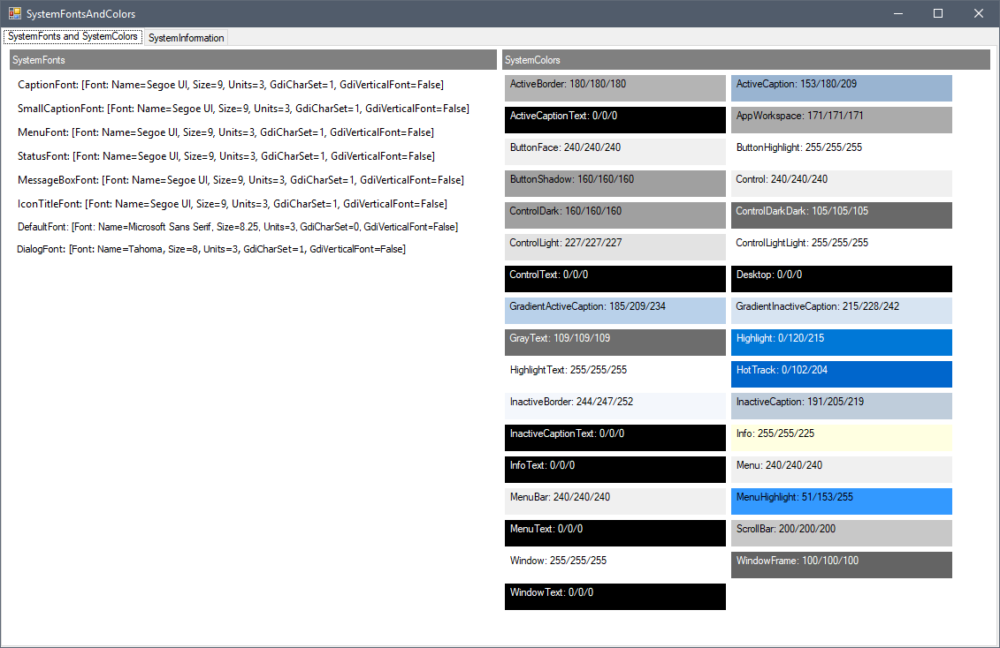

# SystemFontsAndColors

Displays the contents of the static properties in SystemFonts, SystemColors and SystemInformation.

For developers to get a quick insight of the values that might be inside the poorly documented things on different systems.

